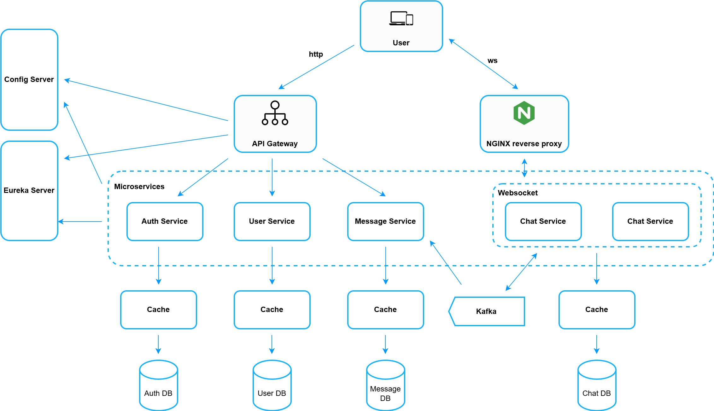
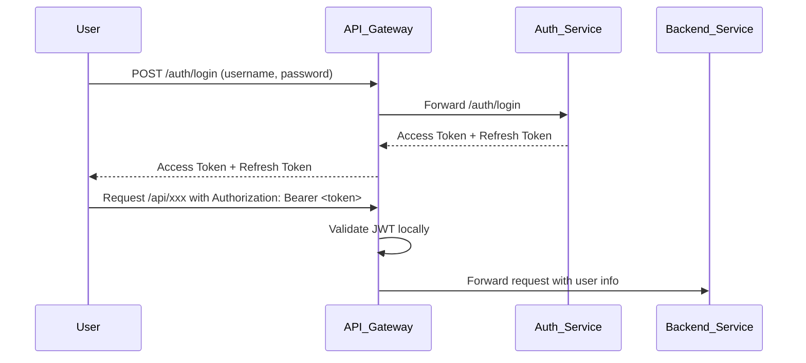
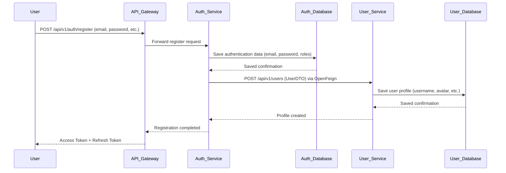
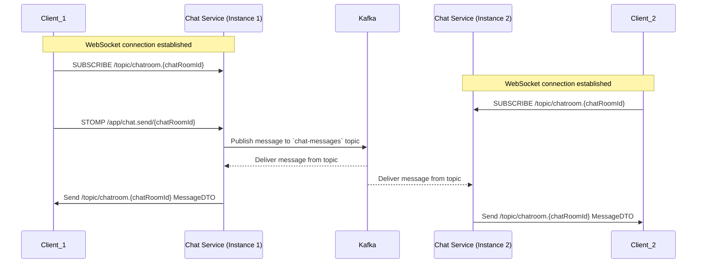
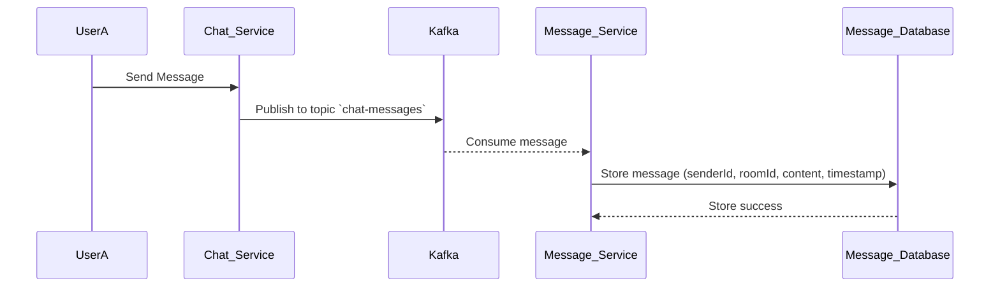

# 💬 Chat System - Microservices Architecture

This project is a full-featured chat platform built using **Spring Boot microservices**, designed for real-world system simulation and backend learning.  
It supports:

- 1-to-1 and group messaging
- User authentication and authorization
- Real-time communication via WebSocket
- Kafka for asynchronous message handling
- Service discovery, centralized configuration, and API gateway routing

---

## 📑 Table of Contents

1. [System Overview](#-system-overview)
2. [API Gateway Service](#-api-gateway)
3. [Auth Service](#️-auth-service---chat-system-microservices)
4. [User Service](#-user-service---chat-system-microservices)
5. [Chat Service](#-chat-service---chat-system-microservices)
6. [Message Service](#-message-service---chat-system-microservices)
7. [Config Service](#️-config-service)
8. [Eureka Server](#-eureka-server)
9. [Chat System Frontend](#-chat-system-frontend)
10. [About Developer](#️-about-the-developer)

## 🧱 System Overview



This project is divided into multiple microservices:

| Service                | Description                                                                                                                                                           | GitHub                                                                       |
| ---------------------- | --------------------------------------------------------------------------------------------------------------------------------------------------------------------- | ---------------------------------------------------------------------------- |
| 🛡️ **Auth Service**    | Handles **user registration**, **login**, and **JWT token issuance**                                                                                                  | [auth-service](https://github.com/minhduc8a2/chat-system-auth-service)       |
| 🔐 **API Gateway**     | Central entry point for all services: **JWT authentication**, **request routing**, **rate limiting**, and **circuit breaking**                                        | [api-gateway](https://github.com/minhduc8a2/chat-system-api-gateway)         |
| 👥 **User Service**    | Manages **user profiles**, including **profile updates** and **public info exposure**                                                                                 | [user-service](https://github.com/minhduc8a2/chat-system-user-service)       |
| 💬 **Chat Service**    | Manages **WebSocket authentication**, **chat rooms**, **real-time messaging**, **user presence tracking**, **per-room read tracking** and **Snowflake ID generation** | [chat-service](https://github.com/minhduc8a2/chat-system-chat-service)       |
| 📨 **Message Service** | Persists **chat messages**; supports **infinite scroll**, **message history**                                                                                         | [message-service](https://github.com/minhduc8a2/chat-system-message-service) |
| 🔧 **Config Server**   | Provides centralized and version-controlled **configuration management** for all microservices                                                                        | [config-server](https://github.com/minhduc8a2/chat-system-config-server)     |
| 🔍 **Eureka Server**   | Enables **service discovery**, **instance registration**, and **health monitoring**                                                                                   | [eureka-server](https://github.com/minhduc8a2/chat-system-eureka-server)     |
| 🖥️ **Frontend**        | React-based SPA client with **chat UI**, **client-side routing** via Tanstack Router, and **optimized virtual list rendering** for scalable message panels            | [frontend](https://github.com/minhduc8a2/chat-system-frontend)               |

---

## 🚀 Technologies Used

This project is built with a **cloud-native microservices architecture**, focusing on scalability, modularity, and real-time interaction.

---

### 🧠 Core Backend Technologies

- **Java 17+** – Modern Java language features and strong typing
- **Spring Boot** – Framework for developing microservices with embedded servers
- **Spring Security** – Authentication and authorization framework
- **JWT (JSON Web Token)** – Stateless, token-based authentication
- **Spring Cloud Gateway** – Reactive gateway for routing and filtering
- **Spring WebSocket (STOMP protocol)** – Enables full-duplex real-time communication

---

### 📨 Messaging and Communication

- **Apache Kafka** – Distributed event streaming platform
- **Spring for Apache Kafka** – Kafka integration with Spring Boot
- **Kafka Topics:**

  - `chat-messages` – Chat message delivery and persistence
  - `presence-messages` – Online status broadcasts
  - `command-messages` – System commands to clients

---

### 💾 Caching, Rate Limiting & Session State

- **Redis** – Used for:

  - Caching
  - Presence tracking
  - WebSocket session tracking
  - Redis Rate Limiter (via Spring Cloud Gateway)

---

### 🗄️ Databases

- **PostgreSQL** – Relational database for structured data persistence (e.g., messages, users)
- **Spring Data JPA** – Object-Relational Mapping (ORM) framework for PostgreSQL

---

### 🔍 Service Discovery & Configuration

- **Eureka Server** – For service registration and load balancing
- **Spring Cloud Netflix Eureka Client** – Enables microservices to register with Eureka
- **Spring Cloud Config Server** – Centralized and Git-based external configuration

---

### 📦 Containerization & Deployment

- **Docker** – Containerize each microservice for portability
- **Docker Compose** – Define and run multi-container environments (ideal for local development)

---

### 🛠️ Developer Tools and Frameworks

- **Lombok** – Simplifies Java boilerplate (e.g., getters, constructors)
- **Spring Cloud OpenFeign** – Declarative REST clients for inter-service communication
- **Hibernate Validator** – Bean validation for request DTOs

---

### 🖥️ Frontend (React SPA)

- **React + TypeScript** – Strongly typed component-based UI development
- **TanStack Router** – Modern routing library for single-page apps
- **TanStack Query (React Query)** – Data fetching with intelligent caching and refetching
- **TanStack Virtual** – Efficient list virtualization (infinite scroll support)
- **Redux Toolkit** – Global state management (auth, UI, etc.)
- **HeroUI** – Headless UI component library with accessibility
- **STOMP over WebSocket** – Real-time chat via `@stomp/stompjs`
- **Axios** – Promise-based HTTP client with JWT interceptor for refresh token logic

---

### 🧪 Monitoring & Observability

- **Spring Boot Actuator** – Exposes health checks, metrics, and runtime endpoints
- **Resilience4j** – Circuit breaker pattern integration for Gateway fault tolerance
- **Custom KeyResolvers** – Used for user/IP-specific rate limiting

---

### 🧱 Architecture

- **Domain-driven Microservices Architecture** – Clear separation of concerns and scalability
- **Stateless Services** – Built to scale horizontally with no local state
- **Event-Driven Communication** – Kafka-based asynchronous processing
- **WebSocket Scaling with Kafka** – Cross-instance message fan-out

---

# 🚪 `API-Gateway`

## 📜 Features

The **API Gateway** acts as the single entry point for all client requests in the system.  
It performs the following responsibilities:

- Authenticate users via a **custom JWT Authentication Filter**.
- Route requests dynamically to microservices discovered via **Eureka Discovery Service**.
- Apply **Circuit Breakers** using **Resilience4j** to handle service failures gracefully.
- Enforce **Rate Limiting** using **Redis Rate Limiter**.
- Handle **Cross-Origin Resource Sharing (CORS)** configuration globally.
- Provide **fallback routes** for degraded services.

---

## 🧰 Technology Stack

- **Spring Boot**
- **Spring Cloud Gateway**
- **Spring Cloud Circuit Breaker (Resilience4j)**
- **Spring Cloud Netflix Eureka**
- **Spring Cloud Config**
- **Redis**

---

## ⚙️ Spring Cloud Gateway Setup

### 1. CORS Configuration

CORS is globally enabled for the frontend (running on `http://localhost:5173`):

- **Allowed Origins**: `http://localhost:5173`
- **Allowed Methods**: GET, POST, PUT, DELETE, PATCH, OPTIONS
- **Allowed Headers**: All (`*`)

### 2. Dynamic Routing and Service Discovery

Service discovery is enabled via Eureka:

```yaml
spring:
  cloud:
    gateway:
      discovery:
        locator:
          enabled: true
```

This allows automatic service registration and dynamic URI resolution using the `lb://` (Load Balancer) prefix.

---

## 🔒 JWT Authentication

A **custom JWT Authentication Filter** is configured at the Gateway level:

- Verifies JWT in the `Authorization: Bearer <token>` header.
- Authenticates the request before forwarding it to downstream services.
- Routes with **unprotected endpoints** (like login, register, refresh token) are **excluded** from authentication.

**Unprotected Endpoints Example**:

| Service      | Unprotected Endpoints                                                 |
| :----------- | :-------------------------------------------------------------------- |
| AUTH-SERVICE | `/api/v1/auth/login`, `/api/v1/auth/register`, `/api/v1/auth/refresh` |

---

## ♻️ Rate Limiting (Redis-Based)

Each route is protected with a **rate limiter**:

- **Replenish Rate**: 3 requests/second
- **Burst Capacity**: 5 requests maximum
- **Requested Tokens per Request**: 1

Rate limiting is based on a **userKeyResolver**, ensuring that each user/IP address is limited individually.

**Example**:

```yaml
filters:
  - name: RequestRateLimiter
    args:
      redis-rate-limiter.replenishRate: 3
      redis-rate-limiter.burstCapacity: 5
      redis-rate-limiter.requestedTokens: 1
      key-resolver: "#{@userKeyResolver}"
```

---

## 🛡️ Circuit Breaker (Resilience4j)

Circuit Breakers are applied for service resilience:

### Default Settings Example (for User Service):

| Property                           | Value      |
| :--------------------------------- | :--------- |
| Sliding Window Size                | 5 requests |
| Permitted Calls in Half-Open State | 2          |
| Failure Rate Threshold             | 50%        |
| Wait Duration in Open State        | 10 seconds |

**Behavior**:

- If 50% of 5 requests fail, the circuit opens for 10 seconds.
- After 10 seconds, 2 trial requests are permitted before closing the circuit.

**Fallback**:  
When a circuit is open, requests are forwarded to `/fallback`.

---

## 🗺️ Defined Routes

| Route ID             | Path               | Destination         | Special Filters               |
| :------------------- | :----------------- | :------------------ | :---------------------------- |
| `user_service_route` | `/api/v1/users/**` | `lb://USER-SERVICE` | Rate Limiter, Circuit Breaker |
| `auth_service_route` | `/api/v1/auth/**`  | `lb://AUTH-SERVICE` | Rate Limiter, Circuit Breaker |
| `chat_service_route` | `/api/v1/chat/**`  | `lb://CHAT-SERVICE` | Rate Limiter, Circuit Breaker |

---

## 🖥️ Monitoring and Management

Spring Boot Actuator is enabled:

- Access `/actuator/gateway/routes` to see all routes dynamically.
- `/actuator/health` provides the Gateway health status.

Expose all endpoints:

```yaml
management:
  endpoints:
    web:
      exposure:
        include: "*"
```

---

# 🛡️ Auth Service - Chat System Microservices

The **Auth Service** handles **user authentication and authorization** for the Chat System.  
It provides secure **registration**, **login**, and **JWT token** management.

---

## 📜 Features

- **User Registration**  
  Allow users to create an account with secure password hashing (**BCrypt**).

- **User Login**  
  Validate credentials and issue **Access Tokens** and **Refresh Tokens**.

- **JWT Token Management**

  - Access Token: Short-lived, used for authentication in API calls.
  - Refresh Token: Longer-lived, used to renew Access Tokens without forcing login again.

- **Role Management**  
  Support user roles `USER`, `ADMIN`.

---

## 🧰 Technology Stack

- **Spring Boot**
- **Spring Data JPA**
- **Spring Data Redis**
- **Spring Cloud OpenFeign**
- **Spring Cloud Netflix**
- **Spring Cloud Config**
- **JWT (JSON Web Tokens)**
- **Redis**
- **PostgreSQL**

---

## 📂 Endpoints Overview

| Method | Endpoint                     | Description                                                |
| ------ | ---------------------------- | ---------------------------------------------------------- |
| POST   | `/api/v1/auth/register`      | Register a new user                                        |
| POST   | `/api//v1/auth/login`        | Login and receive JWT tokens                               |
| POST   | `/api/v1/auth/refresh`       | Refresh an expired access token                            |
| GET    | `/internal/auth/users/{id}`  | Provide basic infomation of a user for other serivces     |
| POST   | `/internal/auth/users/batch` | Provide basic infomation of many users for other serivces |

---

## 🔒 Security Details

- **Password Hashing**: User passwords are hashed using **BCrypt** before storing in the database.
- **JWT Signing**: Tokens are signed with a secret key using **HMAC SHA** algorithm.
- **Token Expiration**:
  - Access Token: 15 minutes
  - Refresh Token: 7 days
- **Refresh Flow**:  
  When an access token expires, clients use a refresh token to obtain a new access token without re-logging in.

---

## ⚙️ How Authentication Works



---

## 🧾 Data Contracts

---

### LoginRequest

```json
{
  "username": "john_doe",
  "password": "SuperSecret123"
}
```

---

### RegisterRequest

```json
{
  "username": "john_doe",
  "password": "SuperSecret123",
  "email": "john.doe@example.com"
}
```

---

### RefreshTokenRequest

```json
{
  "refreshToken": "eyJhbGciOiJIUzI1NiJ9.eyJzdWIiOiIxMjMifQ..."
}
```

---

### AuthResponse

```json
{
  "accessToken": "eyJhbGciOiJIUzI1NiJ9.eyJzdWIiOiIxMjMifQ...",
  "refreshToken": "eyJhbGciOiJIUzI1NiJ9.eyJ1c2VySWQiOiIxMjMifQ..."
}
```

---

### EmailCheckingRequest

```json
{
  "email": "john.doe@example.com"
}
```

---

### BasicUserInfoDTO

```json
{
  "id": "1",
  "username": "john_doe"
}
```

---

### UserDTO

```json
{
  "email": "john.doe@example.com",
  "authId": 1
}
```

---

# 👥 User Service - Chat System Microservices

The **User Service** manages **user profile data** within the Chat System.  
It provides APIs to **create**, **fetch**, **update**, and **list** user profiles securely and efficiently.

---

## 📜 Features

- **User Creation**  
  Create a new user profile upon successful registration at the Auth Service.

- **Email Existence Checking**  
  Allow verification if an email address is already registered (for frontend validations).

- **User Profile Retrieval**  
  Fetch complete user information by their **Auth ID**.

- **User Profile Update**  
  Support partial updates to a user's public profile .

- **Paginated User Listing**  
  Provide paginated and sorted listing of all user profiles for admin or system needs.

---

## 🧰 Technology Stack

- **Spring Boot**
- **Spring Data JPA**
- **Spring Data Redis**
- **Spring Cloud Netflix Eureka**
- **Spring Cloud Config**
- **Hibernate Validator**
- **Redis**
- **PostgreSQL**

---

## 📂 Endpoints Overview

| Method | Endpoint                     | Description                                       |
| ------ | ---------------------------- | ------------------------------------------------- |
| POST   | `/api/v1/users/email_exists` | Check if an email address already exists          |
| POST   | `/api/v1/users`              | Create a new user profile                         |
| GET    | `/api/v1/users/{authId}`     | Get user profile information by authentication ID |
| PATCH  | `/api/v1/users/{authId}`     | Partially update a user profile                   |
| GET    | `/api/v1/users`              | Get a paginated and sorted list of all users      |

---

## 🔒 Security Details

- **Authentication Required**:  
  Accessing user information generally requires a valid **JWT token** via API Gateway.

- **Input Validation**:  
  All incoming requests are validated using **Hibernate Validator** annotations (e.g., `@Valid`, `@Min(1)`).

---

## ⚙️ How the User Profile Creation Flow Works



---

## 📁 Data Contracts

### Create User Profile Request (`UserDTO`)

```json
{
  "authId": 123,
  "email": "user@example.com"
}
```

### Check Email Existence Request (`EmailCheckingRequest`)

```json
{
  "email": "user@example.com"
}
```

### Update User Profile Request (`ClientUserDTO`)

```json
{
  "email": "updated@example.com"
}
```

---

# 💬 Chat Service - Chat System Microservices

The **Chat Service** enables **real-time messaging**, **room management**, and **user presence tracking** for the Chat System.  
It uses **WebSocket with STOMP** for live communication, **Redis** for presence caching, and **Kafka** for scaling message delivery across service instances.

---

## 📜 Features

- **Real-Time Messaging via STOMP**  
  Enables WebSocket-based communication for chat messages and in-app events.  
  Supports 1-to-1 and group messages with delivery status tracking.

- **Distributed Messaging via Kafka**  
  Kafka ensures message delivery across multiple instances of Chat Service.

- **Room Management**  
  Create, list, and join chat rooms. Rooms can be public or private, with custom metadata.

- **User Presence & Online Status**  
  Users send heartbeat pings to indicate active status. Online status is cached in Redis.

- **Presence Event Broadcasting**  
  Notify other users in the same room when someone joins, disconnects, or reconnects.
- **Last-Seen Per-Room Tracking**
  Records the last active timestamp for each user per chat room.
  Used to load unread messages and generate notification badges or "new messages" indicators.

---

## 🧰 Technology Stack

- **Spring Boot**
- **Spring Data JPA**
- **Spring Data Redis**
- **Spring Kafka**
- **Spring WebSocket (STOMP)**
- **Spring Cloud Netflix Eureka**
- **Spring Cloud Config**
- **Redis**
- **Kafka**
- **PostgreSQL**

---

## 📂 Endpoints Overview

### 🌐 REST API (HTTP)

| Method | Endpoint                                                        | Description                                                                              |
| ------ | --------------------------------------------------------------- | ---------------------------------------------------------------------------------------- |
| POST   | `/api/v1/chat/chat-rooms`                                       | Create a new chat room                                                                   |
| GET    | `/api/v1/chat/chat-rooms`                                       | List all chat rooms (pagination supported)                                               |
| GET    | `/api/v1/chat/chat-rooms/user`                                  | List rooms joined by the current user                                                    |
| POST   | `/api/v1/chat/chat-rooms/join/{id}`                             | Join a specific chat room                                                                |
| GET    | `/internal/chat/chat-rooms/{id}/presence/websocket/users/batch` | Check online status of users in a room for other microservices                           |
| GET    | `/internal/chat/room_last_seen?chatRoomId={id}&userId={id}`     | Get the last seen timestamp of a user in a specific room (used for unseen message logic) |

### 📡 WebSocket (STOMP)

| Destination                                | Description                                               |
| ------------------------------------------ | --------------------------------------------------------- |
| `/app/chat.send/{chatroomId}`              | Send message to a chatroom                                |
| `/app/heartbeat`                           | Heartbeat ping to keep presence alive                     |
| `/app/unsubscribe/chat_rooms/{chatroomId}` | Called when user leaves a chatroom tab (tracks last seen) |
| `/user/queue/errors`                       | Receive error messages from server                        |
| `/user/queue/heartbeatReply`               | Receive pong response to heartbeat                        |

---

## 🧠 How the Chat System Works



---

## 📦 Kafka Topics

- **chat-messages** – Published by the Chat Service when a user sends a message, consumed by the Message Service for persistence, and also consumed by all Chat Service instances to deliver the message to connected WebSocket clients.
- **command-messages** – Used for sending system-level commands to the client application, such as updates.
- **presence-messages** – Broadcast online/offline status changes to other clients.

Configured partitions and replicas via `application.yml`:

---

## 🧾 Data Contracts

### ChatRoomDTO

```json
{
  "id": 1,
  "name": "Dev Chatroom",
  "description": "Chat for developers",
  "type": "GROUP",
  "status": "ACTIVE",
  "ownerId": 123,
  "createdAt": "2025-04-29T10:00:00Z",
  "updatedAt": "2025-04-29T10:00:00Z"
}
```

### ClientMessageDTO

```json
{
  "content": "Hello from STOMP!"
}
```

### MessageDTO

```json
{
  "id": 948359823823823,
  "senderId": 1,
  "roomId": 1,
  "content": "Hello!",
  "type": "GROUP",
  "timestamp": "2025-04-29T15:23:00Z"
}
```

### BasicUserInfoDTO

```json
{
  "id": 1,
  "username": "john.doe",
  "isOnline": true
}
```

### UserPresenceDTO

```json
{
  "id": 1,
  "isOnline": false
}
```

---

## 🗄️ Redis Key Patterns

| Purpose                     | Redis Key Format            |
| --------------------------- | --------------------------- |
| Presence tracking           | `presence:user:{userId}`    |
| WebSocket tracking          | `websocket:user:{userId}`   |
| Last-Seen Per-Room Tracking | `active_room:user:{userId}` |

---

## 🔐 Security

- **Authentication**  
  JWT token (from Auth Service) required for WebSocket connections.

- **Authorization Headers**  
  Custom header `X-User-UserId` is passed by API Gateway to identify user across services.

---

## 🚀 Scaling Notes

- **Stateless Design:**  
  Chat Service instances are stateless; Redis handles shared state (e.g., online presence).

- **WebSocket Sessions:**  
  Each instance manages its own WebSocket sessions. Kafka ensures consistent messaging across instances.

- **Load Balanced:**  
  Chat Service is registered with **Eureka** and can be scaled horizontally behind API Gateway.

---

# 📩 Message Service - Chat System Microservices

The **Message Service** is responsible for **persisting chat messages** within the Chat System.  
It consumes messages from **Kafka topics** produced by the **Chat Service** and stores them in a **relational database** for retrieval and history features.

---

## 📜 Features

- **Kafka Message Consumption**  
  Listen to Kafka topics and consume incoming chat messages asynchronously.

- **Message Persistence**  
  Save received messages into the database for long-term storage and chat history reconstruction.

- **Scalable and Fault-Tolerant**  
  Designed for high throughput, with support for partitioned Kafka topics and consumer groups.

- **Structured Message Model**  
  Define and enforce message schemas (e.g., sender, receiver, content, timestamp) for consistency.
- **Infinite Scroll & Unseen Messages Support**
  Optimized to support infinite scroll pagination for chat history and "unseen messages" logic using per-user, per-room lastSeen timestamps.

---

## 🧰 Technology Stack

- **Spring Boot**
- **Spring Kafka**
- **Spring Data JPA**
- **Spring Data Redis**
- **PostgreSQL**
- **Apache Kafka**
- **Spring Cloud OpenFeign**
- **Spring Cloud Netflix Eureka**
- **Spring Cloud Config**

---

## 📂 Kafka Listener Overview

| Topic Name      | Description                                  | Group ID                |
| --------------- | -------------------------------------------- | ----------------------- |
| `chat-messages` | Receives chat messages from the Chat Service | `message-service-group` |

---

<!-- ## 🔐 Security Considerations

- **Data Sanitization**:
  The message content is sanitized before storage to prevent injection attacks and maintain clean records.

--- -->

## 🧭 Message Processing Flow



---

## 📂 Endpoints Overview

### 🌐 REST API (HTTP)

| Method | Endpoint                                                      | Description                                                                             |
| ------ | ------------------------------------------------------------- | --------------------------------------------------------------------------------------- |
| GET    | `/api/v1/messages?chatRoomId={id}&messageId={id}&type={type}` | Fetch chat messages in infinite scroll mode (older or newer) using messageId as anchor. |
| GET    | `/api/v1/messages/last_seen?chatRoomId={id}`                  | Fetch messages from the user’s last seen timestamp in the given chat room.              |

---

## 📁 Data Contracts

### Message Payload (`MessageDTO`)

```json
{
  "id": "812738129374812160",
  "senderId": "1",
  "roomId": "1",
  "content": "Hello!",
  "type":"GROUP"
  "timestamp": "2025-04-29T15:23:00"
}
```

### InfiniteScroll Messages Payload (`InfiniteScrollResult<MessageDTO>`)

```json
{
  "data": "[]",
  "hasMoreOnTop": "false",
  "hasMoreOnBottom": "false"
}
```

---

## ⚙️ Config Service

### 📘 Overview

The **Config Service** acts as a centralized configuration server that manages and serves externalized configuration for all microservices in the system. It allows dynamic updates and consistent configurations across environments (development, staging, production), supporting both versioning and Git-backed configuration.

This service is built using **Spring Cloud Config Server**, which reads configurations from a Git repository and exposes them via HTTP endpoints to client applications.

---

### 🚀 Responsibilities

- Centralize and externalize configurations for all services.
- Support environment-specific configurations.
- Enable dynamic refresh of configurations using Spring Cloud Bus (optional).
- Secure configuration access via role-based permissions (optional).

---

### 🛠️ Technologies

- Spring Boot
- Spring Cloud Config Server
- GitHub (for configuration storage)

---

### 🔧 How Clients Connect

Each microservice (e.g., `chat-service`, `auth-service`, etc.) connects to the Config Service by setting:

```yaml
spring:
  config:
    import: optional:configserver:http://localhost:8080
```

And by setting the service name so it pulls the corresponding config:

```yaml
spring:
  application:
    name: chat-service
```

This will fetch `chat-service.yml` or `chat-service-{profile}.yml`
`chat-service.properties` or `chat-service-{profile}.properties` from the Git repo.

---

## 📡 Eureka Server

### 📘 Overview

The **Eureka Server** is a core component in a microservices architecture, responsible for **service discovery**. It maintains a registry of all microservices and enables client-side load balancing and failover by letting services register themselves and discover other services dynamically.

---

### 🚀 Responsibilities

- Act as a **service registry** where all microservices (clients) can register themselves.
- Provide a **discovery mechanism** for clients to locate other services by name instead of hardcoded URLs.
- Support dynamic updates to the registry (when services scale up/down or fail).
- Enable health check integration to remove unhealthy instances from the registry.

---

### 🛠️ Technologies

- Spring Boot
- Spring Cloud Netflix Eureka Server

---

### 🧾`application.properties`

```properties
spring.application.name=eureka-server
server.port=8761

# Disable client behavior (this server doesn't register itself)
eureka.client.register-with-eureka=false
eureka.client.fetch-registry=false
```

---

### 🌐 Accessing the Eureka Dashboard

Once the server is running on port `8761`, navigate to:

```
http://localhost:8761
```

---

### 🧩 How Services Register

Other services (e.g., `auth-service`, `chat-service`) need to include the `spring-cloud-starter-netflix-eureka-client` dependency.

---

# 📱 Chat System Frontend

This is the **frontend** of a scalable chat system built with **React** and **TypeScript**, designed for performance and maintainability. It supports **real-time communication**, **JWT-based authentication**, and **presence tracking**. The system is integrated with backend services via REST and WebSocket using **STOMP** protocol.

---

## ⚙️ Tech Stack

- **React**
- **TypeScript** for static typing
- **Redux Toolkit** for app-wide state management
- **TanStack Query (React Query)** for async data fetching and caching
- **TanStack Virtual** for performant list virtualization
- **HeroUI** for accessible UI components
- **STOMP over WebSocket** for real-time chat via `@stomp/stompjs`
- **Axios** with JWT token refresh interceptor

---

## 🚀 Highlights

- ⚡ **Virtualized Lists**: Efficient rendering of large chat history using `TanStack Virtual`.
- 🔐 **Secure Authentication**: JWT access/refresh token handling with auto-refresh and retry queue.
- 🧠 **Optimistic UI**: Instant UI updates with intelligent caching via TanStack Query.
- 🔄 **Real-time Communication**: Bi-directional WebSocket messaging via STOMP protocol.
- 🌐 **Presence Tracking**: Tracks user online status via heartbeat logic.
- 🧰 **Modular DTO Models**: Strongly typed classes/interfaces for API responses.

---

## 🔄 Axios Interceptor

Handles:

- Automatic token refresh on `401`
- Retry queue for requests during refresh
- Logout redirection when refresh fails

---

## 🔁 Client-Side Routing

This frontend application is built as a **Single Page Application (SPA)** using **[Tanstack Router](https://reactrouter.com/)** to manage in-app navigation without full page reloads. It supports public and protected routes with authentication status.

### 🚦 Routing Features

- **Protected Routing**: Check authentication status to secure authenticated routes
- **Route Redirection**: Automatically redirects unauthenticated users to `/login`

---

### 📁 Route Structure

| Path         | Component  | Access       | Description                            |
| ------------ | ---------- | ------------ | -------------------------------------- |
| `/`          | `App`      | 🔐 Protected | Default landing page after login       |
| `/chat`      | `Chat`     | 🔐 Protected | Main chat interface                    |
| `/chat/{id}` | `Chat`     | 🔐 Protected | Chat room interface                    |
| `/profile`   | `Profile`  | 🔐 Protected | User profile dashboard                 |
| `/login`     | `Login`    | 🔓 Public    | Login screen for unauthenticated users |
| `/register`  | `Register` | 🔓 Public    | User account registration              |

---

# 🙋‍♂️ About the Developer

This project is built by **@minhduc8a2** as a learning project and portfolio showcase demonstrating modern backend engineering techniques.  
It highlights:

- Service communication patterns (Kafka and REST)
- Stateless JWT-based security
- Horizontal scalability practices
- Microservice isolation for fault tolerance

Feel free to explore each repository for detailed implementations and design choices.
