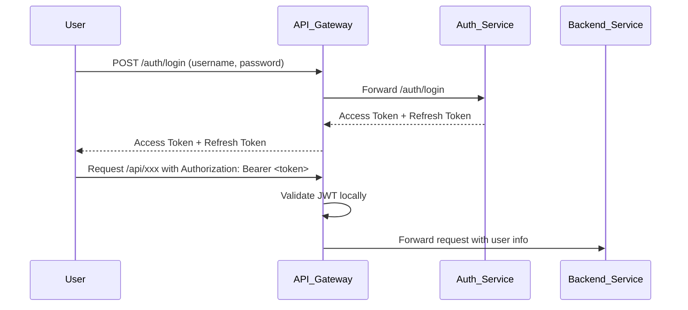
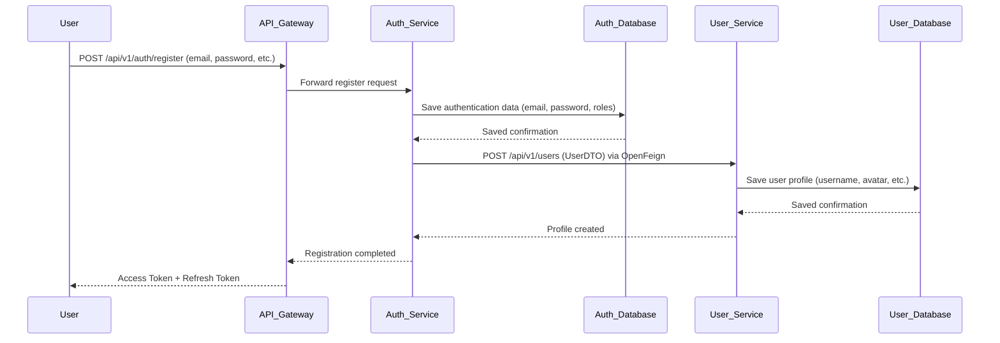

# 💬 Chat System - Microservices Architecture

This project is a full-featured chat platform built using **Spring Boot microservices**, designed for real-world system simulation and backend learning.  
It supports:

- 1-to-1 and group messaging
- User authentication and authorization
- Real-time communication via WebSocket
- Kafka for asynchronous message handling
- Service discovery, centralized configuration, and API gateway routing

---

## 🧱 System Overview


This project is divided into multiple microservices:

| Service                | Description                                                              | GitHub                                                                       |
| ---------------------- | ------------------------------------------------------------------------ | ---------------------------------------------------------------------------- |
| 🛡️ **Auth Service**    | Handles **registration**, **login**, **JWT token generation**            | [auth-service](https://github.com/minhduc8a2/chat-system-auth-service)       |
| 🔐 **API Gateway**     | Central entry point, **JWT filtering**, **routing**, **rate limiting**, **circuit breaker** | [api-gateway](https://github.com/minhduc8a2/chat-system-api-gateway)         |
| 👥 **User Service**    | Manages **user profiles**                                                 | [user-service](https://github.com/minhduc8a2/chat-system-user-service)       |
| 💬 **Chat Service**    | **WebSocket authentication**, **chat room management**, **real-time messaging**, **online status tracking**, **Snowflake ID generation** | [chat-service](https://github.com/minhduc8a2/chat-system-chat-service)       |
| 📨 **Message Service** | Persists **chat messages**                                                | [message-service](https://github.com/minhduc8a2/chat-system-message-service) |
| 🔧 **Config Server**   | Centralized **configuration management**                                 | [config-server](https://github.com/minhduc8a2/chat-system-config-server)     |
| 🔍 **Eureka Server**   | **Service discovery** and **health monitoring**                          | [eureka-server](https://github.com/minhduc8a2/chat-system-eureka-server)     |
| 🖥️ **Frontend**        | React-based client for **chat interface**                                | [frontend](https://github.com/minhduc8a2/chat-system-frontend)               |

---

## 🚀 Technologies Used

- **Backend:** Spring Boot 3, Spring Security, JWT, Spring Cloud Gateway, WebSocket
- **Messaging:** Kafka
- **Caching:** Redis
- **Database:** PostgreSQL
- **Service Discovery & Config:** Eureka, Spring Cloud Config
- **Containerization:** Docker, Docker Compose
- **Architecture:** Microservices

---


## 📂 API Documentation

# 🛡️ Auth Service - Chat System Microservices

The **Auth Service** handles **user authentication and authorization** for the Chat System.  
It provides secure **registration**, **login**, and **JWT token** management.

---

## 📜 Features

- **User Registration**  
  Allow users to create an account with secure password hashing (**BCrypt**).

- **User Login**  
  Validate credentials and issue **Access Tokens** and **Refresh Tokens**.

- **JWT Token Management**
  - Access Token: Short-lived, used for authentication in API calls.
  - Refresh Token: Longer-lived, used to renew Access Tokens without forcing login again.

- **Role Management**  
  Support user roles `USER`, `ADMIN`.

---

## 🧰 Technology Stack

- **Spring Boot**
- **Spring Data JPA**
- **Spring Data Redis**
- **Spring Cloud OpenFeign**
- **Spring Cloud Netflix**
- **Spring Cloud Config**
- **JWT (JSON Web Tokens)**
- **Redis** 
- **PostgreSQL**

---

## 📂 Endpoints Overview

| Method | Endpoint           | Description                  |
|--------|--------------------|------------------------------|
| POST   | `/api/v1/auth/register` | Register a new user          |
| POST   | `/api//v1/auth/login`    | Login and receive JWT tokens |
| POST   | `/api/v1/auth/refresh`  | Refresh an expired access token |
| GET   | `/internal/auth/users/{id}`  | Provider basic infomation of a user for other serivces |
| POST   | `/internal/auth/users/batch`  | Provider basic infomation of many users for other serivces |

---

## 🔒 Security Details

- **Password Hashing**: User passwords are hashed using **BCrypt** before storing in the database.
- **JWT Signing**: Tokens are signed with a secret key using **HMAC SHA** algorithm.
- **Token Expiration**: 
  - Access Token:  15 minutes
  - Refresh Token:  7 days
- **Refresh Flow**:  
  When an access token expires, clients use a refresh token to obtain a new access token without re-logging in.

---

## ⚙️ How Authentication Works


---

# 👥 User Service - Chat System Microservices

The **User Service** manages **user profile data** within the Chat System.  
It provides APIs to **create**, **fetch**, **update**, and **list** user profiles securely and efficiently.

---

## 📜 Features

- **User Creation**  
  Create a new user profile upon successful registration at the Auth Service.

- **Email Existence Checking**  
  Allow verification if an email address is already registered (for frontend validations).

- **User Profile Retrieval**  
  Fetch complete user information by their **Auth ID**.

- **User Profile Update**  
  Support partial updates to a user's public profile .

- **Paginated User Listing**  
  Provide paginated and sorted listing of all user profiles for admin or system needs.

---

## 🧰 Technology Stack

- **Spring Boot**
- **Spring Data JPA**
- **Spring Data Redis**
- **Spring Cloud Netflix Eureka**
- **Spring Cloud Config**
- **Hibernate Validator**
- **Redis**
- **PostgreSQL**

---

## 📂 Endpoints Overview

| Method  | Endpoint                       | Description                                              |
|---------|---------------------------------|----------------------------------------------------------|
| POST    | `/api/v1/users/email_exists`    | Check if an email address already exists                 |
| POST    | `/api/v1/users`                 | Create a new user profile                                |
| GET     | `/api/v1/users/{authId}`         | Get user profile information by authentication ID        |
| PATCH   | `/api/v1/users/{authId}`         | Partially update a user profile       |
| GET     | `/api/v1/users`                  | Get a paginated and sorted list of all users              |

---

## 🔒 Security Details

- **Authentication Required**:  
  Accessing user information generally requires a valid **JWT token** via API Gateway.

- **Input Validation**:  
  All incoming requests are validated using **Hibernate Validator** annotations (e.g., `@Valid`, `@Min(1)`).


---

## ⚙️ How the User Profile Creation Flow Works



---

## 📁 Data Contracts

### Create User Profile Request (`UserDTO`)
```json
{
  "authId": 123,
  "email": "user@example.com",
}
```

### Check Email Existence Request (`EmailCheckingRequest`)
```json
{
  "email": "user@example.com"
}
```

### Update User Profile Request (`ClientUserDTO`)
```json
{
  "email": "updated@example.com",
}
```

---


# 🚪 `API-Gateway` 

## 📜 Features

The **API Gateway** acts as the single entry point for all client requests in the system.  
It performs the following responsibilities:

- Authenticate users via a **custom JWT Authentication Filter**.
- Route requests dynamically to microservices discovered via **Eureka Discovery Service**.
- Apply **Circuit Breakers** using **Resilience4j** to handle service failures gracefully.
- Enforce **Rate Limiting** using **Redis Rate Limiter**.
- Handle **Cross-Origin Resource Sharing (CORS)** configuration globally.
- Provide **fallback routes** for degraded services.

---
## 🧰 Technology Stack

- **Spring Boot**
- **Spring Cloud Gateway**
- **Spring Cloud Circuit Breaker (Resilience4j)**
- **Spring Cloud Netflix Eureka**
- **Spring Cloud Config**
- **Redis**

---

## ⚙️ Spring Cloud Gateway Setup

### 1. CORS Configuration

CORS is globally enabled for the frontend (running on `http://localhost:5173`):

- **Allowed Origins**: `http://localhost:5173`
- **Allowed Methods**: GET, POST, PUT, DELETE, PATCH, OPTIONS
- **Allowed Headers**: All (`*`)

### 2. Dynamic Routing and Service Discovery

Service discovery is enabled via Eureka:

```yaml
spring:
  cloud:
    gateway:
      discovery:
        locator:
          enabled: true
```

This allows automatic service registration and dynamic URI resolution using the `lb://` (Load Balancer) prefix.

---

## 🔒 JWT Authentication

A **custom JWT Authentication Filter** is configured at the Gateway level:

- Verifies JWT in the `Authorization: Bearer <token>` header.
- Authenticates the request before forwarding it to downstream services.
- Routes with **unprotected endpoints** (like login, register, refresh token) are **excluded** from authentication.

**Unprotected Endpoints Example**:

| Service | Unprotected Endpoints |
|:--------|:----------------------|
| AUTH-SERVICE | `/api/v1/auth/login`, `/api/v1/auth/register`, `/api/v1/auth/refresh` |

> **Advice**: Always minimize the number of unprotected endpoints to reduce security risks.

---

## ♻️ Rate Limiting (Redis-Based)

Each route is protected with a **rate limiter**:

- **Replenish Rate**: 3 requests/second
- **Burst Capacity**: 5 requests maximum
- **Requested Tokens per Request**: 1

Rate limiting is based on a **userKeyResolver**, ensuring that each user/IP address is limited individually.

**Example**:

```yaml
filters:
  - name: RequestRateLimiter
    args:
      redis-rate-limiter.replenishRate: 3
      redis-rate-limiter.burstCapacity: 5
      redis-rate-limiter.requestedTokens: 1
      key-resolver: "#{@userKeyResolver}"
```

---

## 🛡️ Circuit Breaker (Resilience4j)

Circuit Breakers are applied for service resilience:

### Default Settings Example (for User Service):

| Property | Value |
|:---------|:------|
| Sliding Window Size | 5 requests |
| Permitted Calls in Half-Open State | 2 |
| Failure Rate Threshold | 50% |
| Wait Duration in Open State | 10 seconds |

**Behavior**:

- If 50% of 5 requests fail, the circuit opens for 10 seconds.
- After 10 seconds, 2 trial requests are permitted before closing the circuit.

**Fallback**:  
When a circuit is open, requests are forwarded to `/fallback`.

---

## 🗺️ Defined Routes

| Route ID | Path | Destination | Special Filters |
|:---------|:-----|:------------|:----------------|
| `user_service_route` | `/api/v1/users/**` | `lb://USER-SERVICE` | Rate Limiter, Circuit Breaker |
| `auth_service_route` | `/api/v1/auth/**` | `lb://AUTH-SERVICE` | Rate Limiter, Circuit Breaker |
| `chat_service_route` | `/api/v1/chat/**` | `lb://CHAT-SERVICE` | Rate Limiter, Circuit Breaker |

---

## 🖥️ Monitoring and Management

Spring Boot Actuator is enabled:

- Access `/actuator/gateway/routes` to see all routes dynamically.
- `/actuator/health` provides the Gateway health status.

Expose all endpoints:

```yaml
management:
  endpoints:
    web:
      exposure:
        include: "*"
```

---


## 🙋‍♂️ About the Developer

This project is built by **@minhduc8a2** as a learning project and portfolio showcase demonstrating modern backend engineering techniques.  
It highlights:

- Service communication patterns (Kafka and REST)
- Stateless JWT-based security
- Horizontal scalability practices
- Microservice isolation for fault tolerance

Feel free to explore each repository for detailed implementations and design choices.
