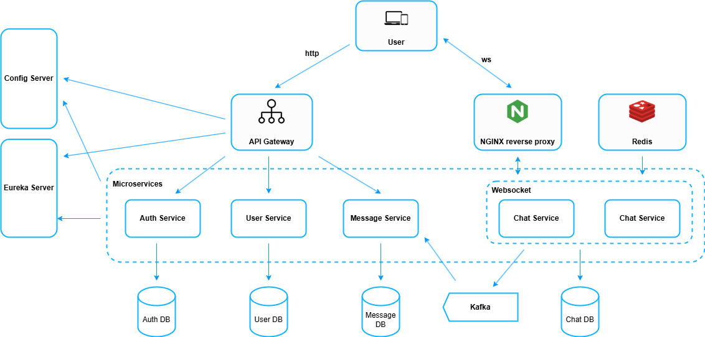

# 💬 Chat System - Microservices Architecture

This project is a full-featured chat platform built using **Spring Boot microservices**, supporting:

- 1-to-1 & group messaging
- User authentication & authorization
- Real-time communication via WebSocket
- Kafka for asynchronous message handling
- Service discovery, configuration server, and gateway

## 🧱 System Overview

This project is split into multiple microservices:

| Service                | Description                                                              | GitHub                                                                       |
| ---------------------- | ------------------------------------------------------------------------ | ---------------------------------------------------------------------------- |
| 🛡️ **Auth Service**    | Handles registration, login, JWT token generation                        | [auth-service](https://github.com/minhduc8a2/chat-system-auth-service)       |
| 🔐 **API Gateway**     | Central entry point, JWT filter, routing, rate limiting, circuit breaker | [api-gateway](https://github.com/minhduc8a2/chat-system-api-gateway)         |
| 👥 **User Service**    | Manages user profiles and blocking                                       | [user-service](https://github.com/minhduc8a2/chat-system-user-service)       |
| 💬 **Chat Service**    | Manages chat rooms and WebSocket messaging                               | [chat-service](https://github.com/minhduc8a2/chat-system-chat-service)       |
| 📨 **Message Service** | Persists messages, Kafka consumer, Snowflake ID generating               | [message-service](https://github.com/minhduc8a2/chat-system-message-service) |
| 🔧 **Config Server**   | Centralized config management                                            | [config-server](https://github.com/minhduc8a2/chat-system-config-server)     |
| 🔍 **Eureka Server**   | Service discovery                                                        | [eureka-server](https://github.com/minhduc8a2/chat-system-eureka-server)     |
| 🖥️ **Frontend**        | React-based client for chat interface                                    | [frontend](https://github.com/minhduc8a2/chat-system-frontend)               |

## 🚀 Technologies Used

- **Spring Boot 3**, **Spring Security**, **JWT**, **Spring Cloud Gateway**
- **WebSocket**, **Kafka**, **Redis**, **PostgreSQL**
- **Spring Cloud Config**, **Eureka**, **Docker**, **Microservices Architecture**

## ⚙️ Deployment

> Run all services using Docker Compose (coming soon!)

## 📂 API Documentation

- Coming soon in `docs/`

## 🙋‍♂️ About the Developer

This project is built by **@minhduc8a2** as a learning and portfolio showcase of modern backend engineering techniques. It demonstrates:

- Service communication patterns (Kafka & REST)
- Stateless JWT-based security
- Horizontal scalability practices
- Microservice isolation

Feel free to explore each repository for more detail.
