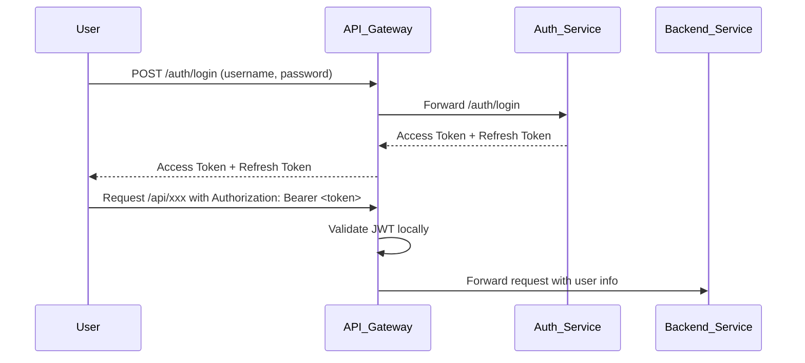

# 💬 Chat System - Microservices Architecture

This project is a full-featured chat platform built using **Spring Boot microservices**, designed for real-world system simulation and backend learning.  
It supports:

- 1-to-1 and group messaging
- User authentication and authorization
- Real-time communication via WebSocket
- Kafka for asynchronous message handling
- Service discovery, centralized configuration, and API gateway routing

---

## 🧱 System Overview

This project is divided into multiple microservices:

| Service                | Description                                                              | GitHub                                                                       |
| ---------------------- | ------------------------------------------------------------------------ | ---------------------------------------------------------------------------- |
| 🛡️ **Auth Service**    | Handles **registration**, **login**, **JWT token generation**            | [auth-service](https://github.com/minhduc8a2/chat-system-auth-service)       |
| 🔐 **API Gateway**     | Central entry point, **JWT filtering**, **routing**, **rate limiting**, **circuit breaker** | [api-gateway](https://github.com/minhduc8a2/chat-system-api-gateway)         |
| 👥 **User Service**    | Manages **user profiles**                                                 | [user-service](https://github.com/minhduc8a2/chat-system-user-service)       |
| 💬 **Chat Service**    | **WebSocket authentication**, **chat room management**, **real-time messaging**, **online status tracking**, **Snowflake ID generation** | [chat-service](https://github.com/minhduc8a2/chat-system-chat-service)       |
| 📨 **Message Service** | Persists **chat messages**                                                | [message-service](https://github.com/minhduc8a2/chat-system-message-service) |
| 🔧 **Config Server**   | Centralized **configuration management**                                 | [config-server](https://github.com/minhduc8a2/chat-system-config-server)     |
| 🔍 **Eureka Server**   | **Service discovery** and **health monitoring**                          | [eureka-server](https://github.com/minhduc8a2/chat-system-eureka-server)     |
| 🖥️ **Frontend**        | React-based client for **chat interface**                                | [frontend](https://github.com/minhduc8a2/chat-system-frontend)               |

---

## 🚀 Technologies Used

- **Backend:** Spring Boot 3, Spring Security, JWT, Spring Cloud Gateway, WebSocket
- **Messaging:** Kafka
- **Caching:** Redis
- **Database:** PostgreSQL
- **Service Discovery & Config:** Eureka, Spring Cloud Config
- **Containerization:** Docker, Docker Compose
- **Architecture:** Microservices

---

## 📂 API Documentation

# 🛡️ Auth Service - Chat System Microservices

The **Auth Service** handles **user authentication and authorization** for the Chat System.  
It provides secure **registration**, **login**, and **JWT token** management.

---

## 📜 Features

- **User Registration**  
  Allow users to create an account with secure password hashing (**BCrypt**).

- **User Login**  
  Validate credentials and issue **Access Tokens** and **Refresh Tokens**.

- **JWT Token Management**
  - Access Token: Short-lived, used for authentication in API calls.
  - Refresh Token: Longer-lived, used to renew Access Tokens without forcing login again.

- **Role Management**  
  Support user roles `USER`, `ADMIN`.

---

## 🧰 Technology Stack

- **Spring Boot**
- **Spring Data JPA**
- **Spring Data Redis**
- **Spring Cloud OpenFeign**
- **Spring Cloud Netflix**
- **Spring Cloud Config**
- **JWT (JSON Web Tokens)**
- **Redis** (for storing refresh tokens or blacklisted tokens — optional)
- **PostgreSQL** (for user data persistence)

---

## 📂 Endpoints Overview

| Method | Endpoint           | Description                  |
|--------|--------------------|------------------------------|
| POST   | `/api/v1/auth/register` | Register a new user          |
| POST   | `/api//v1/auth/login`    | Login and receive JWT tokens |
| POST   | `/api/v1/auth/refresh`  | Refresh an expired access token |
| GET   | `/internal/auth/users/{id}`  | Provider basic infomation of a user for other serivces |
| POST   | `/internal/auth/users/batch`  | Provider basic infomation of many users for other serivces |

---

## 🔒 Security Details

- **Password Hashing**: User passwords are hashed using **BCrypt** before storing in the database.
- **JWT Signing**: Tokens are signed with a secret key using **HMAC SHA** algorithm.
- **Token Expiration**: 
  - Access Token:  15 minutes
  - Refresh Token:  7 days
- **Refresh Flow**:  
  When an access token expires, clients use a refresh token to obtain a new access token without re-logging in.

---

## ⚙️ How Authentication Works

---

## 🙋‍♂️ About the Developer

This project is built by **@minhduc8a2** as a learning project and portfolio showcase demonstrating modern backend engineering techniques.  
It highlights:

- Service communication patterns (Kafka and REST)
- Stateless JWT-based security
- Horizontal scalability practices
- Microservice isolation for fault tolerance

Feel free to explore each repository for detailed implementations and design choices.
